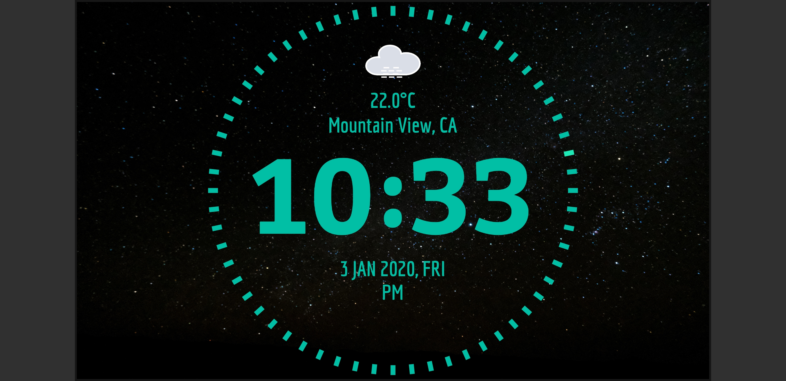

# Flutter Clock Face

Welcome to Flutter Digital Clock!

This is a flutter based digital clock for [flutter clock challenge](https://flutter.dev/clock)


[Live demo](https://shalikaashan01.github.io/flutter-digital-clock/#/) (This is not the exact look of clock face. Background image is not showing in web preview)
# Features

* Dark Mode and Light Mode
* 4 Different background for light mode
* Animation for Weather conditions
* Diffrent weather animations for day and night (except: thunderstorm,snowy,windy,foggy)

# Screenshots 

## Dark mode


## Light mode

 
 

# Weather Conditions

```diff
- There are more backgrround images for each weather conditions. 
+ i.e: cloudy weather animation for every light mode backgrounds
```
## Cloudy

 

## Sunny

  

## Foggy

 

## Snowy

 

## Rainy

  

## Snowy

 

## Windy

 

## Thunderstrom

 

